# 🧊 BLACKICE Academy

**BLACKICE Academy** is a hands-on, cinematic platform for learning **ethical hacking** and **defensive security**.  
Think of it as a fusion of *CTF labs*, *guided missions*, and a *Defender’s dashboard* — where you can not only **break in** but also **patch up**.  

🔥 Hack it.  
🛡️ Defend it.  
📈 Learn both sides.[![zread](https://img.shields.io/badge/Ask_Zread-_.svg?style=for-the-badge&color=00b0aa&labelColor=000000&logo=data%3Aimage%2Fsvg%2Bxml%3Bbase64%2CPHN2ZyB3aWR0aD0iMTYiIGhlaWdodD0iMTYiIHZpZXdCb3g9IjAgMCAxNiAxNiIgZmlsbD0ibm9uZSIgeG1sbnM9Imh0dHA6Ly93d3cudzMub3JnLzIwMDAvc3ZnIj4KPHBhdGggZD0iTTQuOTYxNTYgMS42MDAxSDIuMjQxNTZDMS44ODgxIDEuNjAwMSAxLjYwMTU2IDEuODg2NjQgMS42MDE1NiAyLjI0MDFWNC45NjAxQzEuNjAxNTYgNS4zMTM1NiAxLjg4ODEgNS42MDAxIDIuMjQxNTYgNS42MDAxSDQuOTYxNTZDNS4zMTUwMiA1LjYwMDEgNS42MDE1NiA1LjMxMzU2IDUuNjAxNTYgNC45NjAxVjIuMjQwMUM1LjYwMTU2IDEuODg2NjQgNS4zMTUwMiAxLjYwMDEgNC45NjE1NiAxLjYwMDFaIiBmaWxsPSIjZmZmIi8%2BCjxwYXRoIGQ9Ik00Ljk2MTU2IDEwLjM5OTlIMi4yNDE1NkMxLjg4ODEgMTAuMzk5OSAxLjYwMTU2IDEwLjY4NjQgMS42MDE1NiAxMS4wMzk5VjEzLjc1OTlDMS42MDE1NiAxNC4xMTM0IDEuODg4MSAxNC4zOTk5IDIuMjQxNTYgMTQuMzk5OUg0Ljk2MTU2QzUuMzE1MDIgMTQuMzk5OSA1LjYwMTU2IDE0LjExMzQgNS42MDE1NiAxMy43NTk5VjExLjAzOTlDNS42MDE1NiAxMC42ODY0IDUuMzE1MDIgMTAuMzk5OSA0Ljk2MTU2IDEwLjM5OTlaIiBmaWxsPSIjZmZmIi8%2BCjxwYXRoIGQ9Ik0xMy43NTg0IDEuNjAwMUgxMS4wMzg0QzEwLjY4NSAxLjYwMDEgMTAuMzk4NCAxLjg4NjY0IDEwLjM5ODQgMi4yNDAxVjQuOTYwMUMxMC4zOTg0IDUuMzEzNTYgMTAuNjg1IDUuNjAwMSAxMS4wMzg0IDUuNjAwMUgxMy43NTg0QzE0LjExMTkgNS42MDAxIDE0LjM5ODQgNS4zMTM1NiAxNC4zOTg0IDQuOTYwMVYyLjI0MDFDMTQuMzk4NCAxLjg4NjY0IDE0LjExMTkgMS42MDAxIDEzLjc1ODQgMS42MDAxWiIgZmlsbD0iI2ZmZiIvPgo8cGF0aCBkPSJNNCAxMkwxMiA0TDQgMTJaIiBmaWxsPSIjZmZmIi8%2BCjxwYXRoIGQ9Ik00IDEyTDEyIDQiIHN0cm9rZT0iI2ZmZiIgc3Ryb2tlLXdpZHRoPSIxLjUiIHN0cm9rZS1saW5lY2FwPSJyb3VuZCIvPgo8L3N2Zz4K&logoColor=ffffff)](https://zread.ai/hacktek90/BLACK-Ice)
## 🚀
👉 [Live Site](https://blackice-ac.vercel.app/)  

---
[](https://blackice-ac.vercel.app/)

---

## 📑 Table of Contents
- [Features](#-features)
- [Getting Started](#-getting-started)
- [Usage](#-usage)
- [Contributing](#-contributing)
- [Ethics & Legal](#-ethics--legal)
- [Roadmap](#-roadmap)
- [Screenshots](#-screenshots)
- [Credits](#-credits)

---

## ✨ Features

- 🎯 **Missions & Writeups** – progressive challenges with graded hints and solutions.  
- 🕹️ **Sandboxed CTF Labs** – safe, contained vulnerable targets (*e.g., Crack the login*).  
- 🌐 **Curriculum Tracks** – *Network Penetration*, *Web Exploitation*, *Forensics & Blue Team*.  
- 👨‍💻 **Defender View** – telemetry traces, diffs, and mitigation practice.  
- 🏆 **Gamified Learning** – leaderboards, badges, and community-driven competition.  

---

## 📂 Project Structure

```

/
├─ index.html          # Landing page
├─ assets/             # CSS, JS, images
├─ labs/               # Vulnerable lab setups
│  ├─ lab-01/
│  └─ lab-02/
├─ missions/           # Missions and guided challenges
└─ docs/               # Extra docs, syllabus

````
## 🛠️ Tech Stack
- HTML5 + CSS3 + JavaScript (Vanilla)
- GitHub Pages (deployment)
- Optional: Docker (for isolated labs)
- Optional: Node.js Live Server (for dev)

---

## ⚡ Getting Started

### Clone & Run Locally
```bash
git clone https://github.com/<your-username>/BLACK-Ice.git
cd BLACK-Ice
````

### Quick Preview

```bash
python3 -m http.server 8000
# then open http://localhost:8000
```

### With Live Reload (recommended)

```bash
npm install -g live-server
live-server
```

---

## 🚀 Usage

1. Explore curriculum modules.
2. Launch labs in an isolated environment — **never on production systems**.
3. Switch to Defender View to trace, patch, and validate mitigations.
4. Climb the leaderboard. 🏆

---

## 🤝 Contributing

We welcome contributions from fellow hackers & defenders.
Here’s how to join the mission:

1. **Fork** the repo & create a feature branch:
   `git checkout -b feature/your-feature`
2. Add your lab, mission, or fix.
3. Follow safe-lab principles (isolated, reproducible).
4. **Open a Pull Request** with details of your change.

💡 Ideas we love: new CTF labs, blue-team scenarios, UI/UX polish, accessibility fixes.

---

## ⚖️ Ethics & Legal

> 🚨 **For Educational Purposes Only** 🚨

BLACKICE Academy is designed for safe, authorized practice.

* Do **not** use these techniques on systems without **explicit permission**.
* All labs are intentionally vulnerable — **don’t point exploits at the real world**.
* Play fair, learn responsibly.

---

## 🔒 Security & Responsible Disclosure

If you spot a vulnerability in this repo itself:

1. Don’t post it publicly.
2. Report it privately to the maintainers.
3. We’ll fix it promptly & credit you.

---

## 🛣️ Roadmap

* [ ] Cloud-native attack/defense labs
* [ ] Replayable attack telemetry timeline
* [ ] Dockerized offline bundles
* [ ] Auto-graded certification-style missions

---

## 📜 License

MIT License (or replace with your chosen license).

---

## 👾 Credits

Crafted as **BLACKICE Academy** — a training ground for the next-gen red & blue teamers.
---
Supported through free host by

